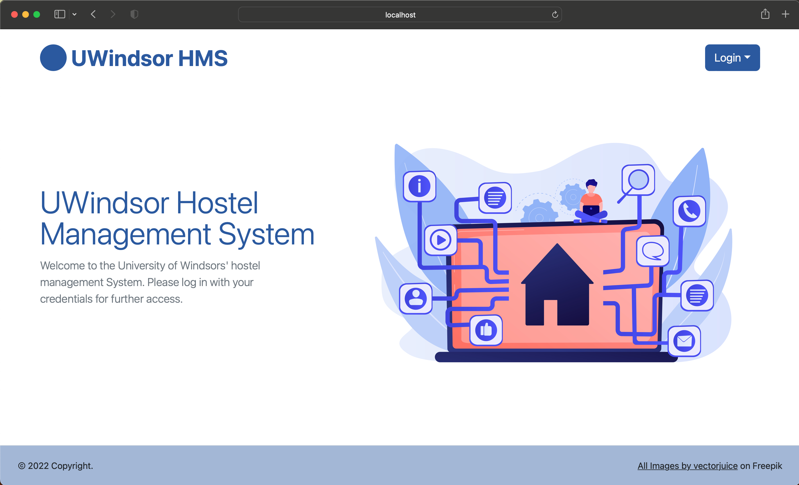
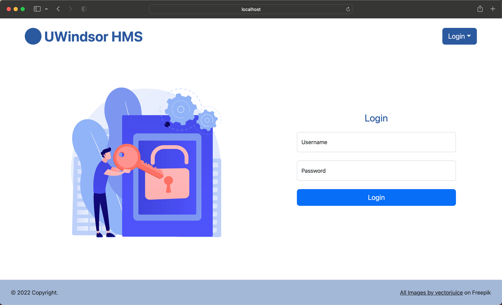

# Hostel Management System (HMS)

[Link to HMS Application](http://moham12y.myweb.cs.uwindsor.ca/hms/)

A hostel management application created as a project for a database course.  This application is mainly for managing student accommodation for a university.

[Prototypes](prototypes/README.md)

## Login

The application has three types of users: [Students](#student-logins), [Student Advisors](#advisor-logins) and [Hostel Staff](#staff-logins).
### Student Logins
| Username 	| Password 	|
|----------	|----------	|
| contuck  	| !69Wma7% 	|
| jessyeck 	| Z%2u*79T 	|
| ciarsean 	| 4v!E6*3m 	|
| andralb  	| 5RusM91# 	|
| mohatad  	| 4UI*4pn4 	|

### Advisor Logins
| Username 	| Password 	|
|----------	|----------	|
| jackwood  | l%w#D075	|
| binobenne | VJ8#8av9 	|

### Staff Logins

| Username 	| Password 	|
|----------	|----------	|
| marijenk  | 6d2A!159 	|
| maricaho 	| z5a@A84h 	|

## Development Setup

1. Install [MySQL](https://dev.mysql.com/downloads/installer/)
2. Install PHP `brew install php` (on mac)
3. Run `mysql -h localhost -u root -p`
4. Create the database
5. Add the databses in [the sql file](phase3_create.sql)
6. Create your own user `CREATE USER 'user'@'localhost' IDENTIFIED BY 'password';`
7. Give it enough priveleges `GRANT ALL ON database.* TO 'username'@'localhost';`
8. Edit [database.php](database.php) with the new databse, username, and password you created
9. Run `php -S localhost:9000`. Make sure you're running it where the php files are located.
10. Open localhost:9000

## Credits
All of the amazing images used in the application are by [vectorjuice on Freepick](https://www.freepik.com/author/vectorjuice).

